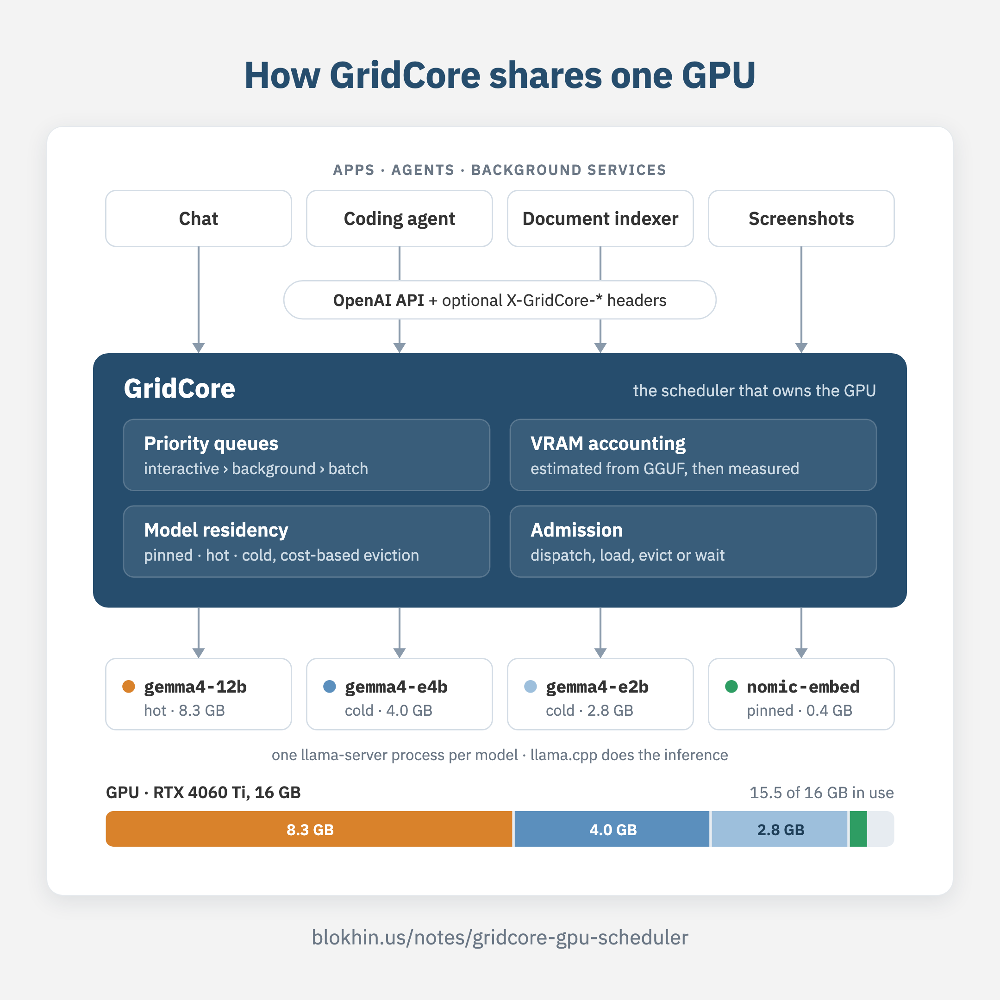
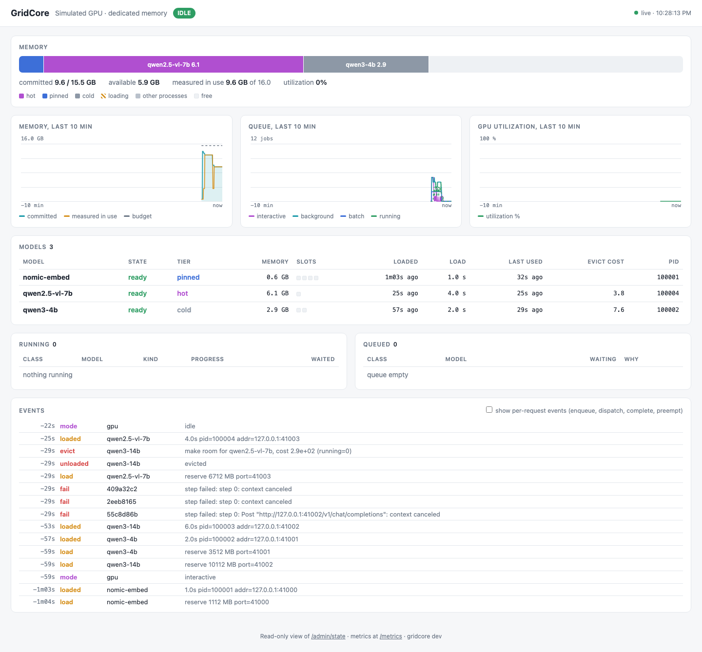

# GridCore

**A workload scheduler for local AI computers.**

One GPU. Several things want it at once: an interactive chat, a coding agent,
an indexer embedding your files in the background, a screenshot analyser
that wakes up every few seconds. Today each of them talks to its own
`llama-server` or Ollama and they fight over VRAM and compute; whoever loaded
last wins, and the chat you are typing into stalls because an indexer is
busy.

GridCore sits between your applications and the inference runtime and
**owns the GPU**. Applications keep using the OpenAI API. GridCore decides
what runs now, what waits, which model stays resident and which one gets
evicted to make room.

<p align="center">
  <a href="https://blokhin.us/notes/gridcore-gpu-scheduler/">
    
  </a>
</p>

It is not a model router ("which LLM is smartest for this prompt"). It is
closer to an operating-system scheduler: it manages *workload classes*,
*models* and *VRAM* on a machine you own.

<p align="center">
  <a href="https://www.youtube.com/watch?v=Mu3xzCVoHXc">
    
  </a>
  <br>
  <sub>▶ <a href="https://www.youtube.com/watch?v=Mu3xzCVoHXc">I Built a Scheduler So My Local LLMs Can Share One GPU</a> on Zero to MVP</sub>
</p>

## What it does

- **Three workload classes.** `interactive` always goes first. `background`
  and `batch` run when the GPU is free, are chunked, and yield between chunks
  so a chat request never waits behind an embedding job. Under continuous
  interactive traffic background still makes progress, one small step at a
  time and at most `background_share` of the time (half by default), and
  batch never waits behind background longer than `batch_max_starvation`.
  Nothing starves.
- **VRAM-aware admission.** Before a model is loaded GridCore knows whether
  it fits: it reads the GGUF header and estimates weights, KV cache and
  buffers (within about 10% on tested models), honouring the llama.cpp
  offload flags in the model's args (`-ngl`, `--cpu-moe`, `--n-cpu-moe`,
  `-ot ...=CPU`), then replaces the estimate with the measured footprint
  after the first load.
- **Model residency.** Models stay loaded while they are useful. A model the
  user is actively chatting with is *hot* and cannot be evicted by background
  work; `pinned` models (embeddings) are never evicted. When something else
  needs the room, the cold models that are cheapest to lose go first: reload
  time weighed by how often each class asked for them lately, so a model
  used every few seconds outlives one used once a moment ago. Two models
  that do not fit together take turns (`min_residency`) instead of pushing
  each other out on every request, and a model that keeps coming back is
  reported as thrash with a hint.
- **Model families.** One name for several sizes of the same model. A
  person waiting gets the best variant that can be had; background work gets
  the one that disturbs nothing — on a busy card an ambient task lands on
  Gemma's E4B next to the 12B the user is chatting with instead of waiting
  for it.
  Requests with images or audio only go to variants that take them.
- **Self-correcting.** If a load runs out of memory the stored measurement is
  discarded and the next attempt is refused up front with a clear error
  instead of crashing three more times. Repeated failures trip a circuit
  breaker per model. A crashed daemon's orphaned runtimes are reaped on the
  next start.
- **Observable.** A dashboard at `/admin/ui`, `gridcore status --watch` in
  the terminal, a JSON state endpoint and Prometheus metrics, all showing
  what is running, queued and resident.
  Decisions explain themselves: an eviction states what the victim cost, a
  waiting job says which model holds the memory and why, a family request
  says why it got the variant it got.

## Quickstart

Requirements: Linux x86_64, an NVIDIA GPU with a working driver
(`nvidia-smi` prints your card), and some GGUF models. On an Apple Silicon
Mac, see [below](#on-an-apple-silicon-mac).

```bash
# 1. GridCore binary
curl -fsSL https://github.com/w512/GridCore/releases/latest/download/gridcore-linux-amd64 \
  -o ~/.local/bin/gridcore && chmod +x ~/.local/bin/gridcore

# 2. llama.cpp (prebuilt CUDA release into /opt/llama.cpp/current)
curl -fsSL https://raw.githubusercontent.com/w512/GridCore/master/scripts/install-llamacpp.sh | bash

# 3. Config: point it at your models
mkdir -p ~/.config/gridcore
curl -fsSL https://raw.githubusercontent.com/w512/GridCore/master/config.example.yaml \
  -o ~/.config/gridcore/config.yaml
$EDITOR ~/.config/gridcore/config.yaml        # paths under models:

# 4. Check, measure, run
gridcore check
gridcore bench --all                          # loads each model once, records VRAM / speed
gridcore serve
```

Then, from any OpenAI client:

```bash
curl localhost:8080/v1/chat/completions -d '{
  "model": "gpt-4o",
  "messages": [{"role": "user", "content": "hello"}]
}'
```

`gpt-4o` here is an alias from the config, so existing tools work without
changes. Open <http://127.0.0.1:8080/> in a browser for the dashboard, or
run `gridcore status --watch` in another terminal, to see the scheduler
work.

### On an Apple Silicon Mac

On master, coming in v0.3 (the v0.2 binaries run real models on Linux and
NVIDIA only): GridCore runs models through llama.cpp's Metal backend. Until
the release, build it from source:

```bash
brew install llama.cpp go
git clone https://github.com/w512/GridCore && cd GridCore
make build && mkdir -p ~/.local/bin && cp bin/gridcore ~/.local/bin/
mkdir -p ~/.config/gridcore
cp examples/apple-24gb.yaml ~/.config/gridcore/config.yaml
$EDITOR ~/.config/gridcore/config.yaml        # paths under models:

gridcore check                                # Apple M4 Pro, 16384 MB unified memory
gridcore bench --all
gridcore serve
```

[`deploy/gridcore.plist`](deploy/gridcore.plist) runs it as a launchd
agent. The GPU shares RAM with macOS and your apps, and that changes the
accounting:

- The budget is Metal's working-set limit (two thirds of RAM by default,
  16 GB on a 24 GB Mac; `gridcore check` says where the number came from),
  and a model's size is all the RAM it takes, the parts llama.cpp keeps on
  the CPU included: a Gemma 4 12B is 9.2 GB here against 8.5 GB on a 16 GB
  NVIDIA card.
- llama.cpp runs without mmap, its RAM prompt cache and context
  checkpoints unless a model's `args` ask for them: each grows a process
  after it has been measured (the prompt cache alone took a 12B from 8.8
  to 18.2 GB in a dozen prompts).
- An overcommitted Metal device does not fail the load: every running model
  starts failing its requests. So the default headroom is 1 GB, models load
  one at a time, and an out-of-memory report from a running model unloads
  the one loaded last.
- macOS memory pressure is watched as well. At "warn", background and batch
  work run only on models already loaded; at "critical", cold models are
  unloaded one at a time. Requests a person is waiting for are never held.

On an M4 Pro 24 GB with a browser and an IDE open, the mixed load test
below (3 minutes) loaded each model once and failed no request; chat p50
was 6.6 s, p95 7.9 s. The 12B, the E2B and the embedder stay resident
together; the E4B does not fit next to them, so background work that needs
it waits.

### No GPU at all: a simulated card

The whole scheduler (classes, queues, admission, eviction, families) also
runs against a simulated 16 GB card, on any machine. On a Mac:

```bash
# Apple Silicon; on an Intel Mac take gridcore-darwin-amd64
curl -fsSL https://github.com/w512/GridCore/releases/latest/download/gridcore-darwin-arm64 \
  -o gridcore && chmod +x gridcore
curl -fsSL https://raw.githubusercontent.com/w512/GridCore/master/examples/simulation.yaml \
  -o simulation.yaml

./gridcore serve --config simulation.yaml
./gridcore status --watch                     # in a second terminal
```

The simulated models answer with a canned reply, but load times, VRAM and
every scheduling decision behave as on a real card: send the `curl` above
and the first request waits about 6 s while `qwen3-14b` "loads". Download
with `curl` as shown: macOS quarantines a binary saved from the browser and
refuses to start it (`xattr -d com.apple.quarantine gridcore` lifts that).

With a clone of the repo, `scripts/demo-*.sh` replay the two scenarios
below, and `scripts/demo-tmux.sh --simulation` opens the live dashboard
(needs Go and tmux). On Linux without a GPU the same works with
`gridcore-linux-amd64`.

## Telling GridCore what a request is

Everything defaults to `interactive`. Background work says so, in whichever
way is convenient for the client:

| Channel | Example |
|---|---|
| Header | `X-GridCore-Class: background` |
| Body (any OpenAI SDK via `extra_body`) | `"gridcore": {"class": "background", "max_wait_ms": 30000}` |
| Model suffix | `"model": "nomic-embed@batch"` |

Header wins over body, body over suffix. `X-GridCore-Max-Wait-Ms` (or
`max_wait_ms`) turns an unbounded wait into a `503 queue_timeout` with
`Retry-After`.

`interactive` is for requests a person is waiting on. A coding agent that
works on its own should send `background`: running back to back as
interactive it keeps the GPU in interactive mode, and everything else gets
only `background_share` of it. On the 4060 Ti that cost the agent itself
~10% when switched to background, while the indexer next to it did 4.6
times more work and screenshot analysis got twice as fast.

Responses carry `X-GridCore-Job-Id`, `X-GridCore-Model` (the resolved id),
`X-GridCore-Queue-Ms` (how long the request waited for the GPU) and, for
family requests, `X-GridCore-Family`.

| Class | Runs | Evicts |
|---|---|---|
| `interactive` | immediately if at all possible | cold models, and idle hot ones |
| `background` | when no interactive work is active; under constant chat one step at a time after `background_max_starvation`, at most `background_share` of the time | cold models, except one loaded for other background work less than `min_residency` ago |
| `batch` | like background, but only when background has nothing queued — or once it has waited `batch_max_starvation` | cold models, except one background used in the last `min_residency` (until `batch_max_starvation`) |

Large `/v1/embeddings` inputs are split into chunks (32 by default) and each
chunk is a separate scheduling step; the client still gets one response.

### Model families

A family is one name for several variants of the same model, so the
scheduler can pick the size that fits the moment:

```yaml
families:
  gemma4: { preferred: gemma4-12b, balanced: gemma4-e4b, compact: gemma4-e2b }
```

`"model": "gemma4"` from a chat gets the best variant it can have — the
12B, evicting cold or idle models just as a request for `gemma4-12b`
would — and a smaller one only when the 12B cannot be made resident at all.
From background work it gets the best variant that runs without evicting
anything and without taking a slot of the model the user is chatting with:
an ambient task next to a busy 12B lands on the E4B instead of waiting.
`"gridcore": {"quality": "balanced"}` (or `X-GridCore-Quality`) excludes
the tiers below; a request with an image (audio) only goes to variants with
the `vision` (`audio`) capability; `X-GridCore-Model` in the response names
the variant. Embedding models cannot be in a family: vectors from different
models are not comparable.

## Configuration

```yaml
server: { listen: 127.0.0.1:8080 }

gpu:
  device: nvidia:0          # or apple (Apple Silicon), or simulation
  headroom_mb: 512          # budget = min(total, vram_limit_mb) - headroom
  vram_limit_mb: null       # cap GridCore below the card, e.g. to leave room for other apps

runtimes:
  llamacpp:
    binary: /opt/llama.cpp/current/llama-server
    default_args: ["--flash-attn", "on"]

models:
  gemma4-12b:
    runtime: llamacpp
    path: ~/models/gemma-4-12b-it-qat-q4_0.gguf
    mmproj: ~/models/mmproj-gemma-4-12b-it-qat-q4_0.gguf
    capabilities: [chat, vision]
    ctx: 16384              # total context pool, shared by slots (llama-server --ctx-size)
    parallel: 2             # slots = concurrent requests for this model
    aliases: [gpt-4o, default-chat]

  nomic-embed:
    runtime: llamacpp
    path: ~/models/nomic-embed-text-v1.5.f16.gguf
    capabilities: [embedding]
    pinned: true            # preload, never evict

policy:
  classes:
    interactive: { hot_ttl: 5m }          # how long a model stays protected after interactive use
  interactive_idle_before_background: 2s  # quiet period before background may start
  background_max_starvation: 3s           # under constant chat, background waits at most this for a step...
  background_share: 0.5                   # ...and runs alongside chat at most this share of the time
  batch_max_starvation: 2m                # bound on how long batch waits behind background
  eviction: cost                          # evict what is cheapest to lose (reload time x recent demand); or lru
  min_residency: 30s                      # models that do not fit together take turns instead of thrashing
  embedding_chunk_size: 32
```

`gridcore models --explain` shows the VRAM estimate per model and where it
comes from. See [`config.example.yaml`](config.example.yaml) for every knob.

## What it looks like

Three scenarios from a 16 GB RTX 4060 Ti with real models. The first two
are `scripts/demo-background-vs-interactive.sh` and `scripts/demo-eviction.sh`:

```
Start background indexing: 1000 documents in 32-document chunks
150 ms later a user starts chatting
   interactive gemma4-12b     HTTP 200  1.21s  queue     0ms  A GPU scheduler manages the execution of ...
Indexing finishes after the chat
   background  nomic-embed    HTTP 200  4.08s  items=1000

   17:45:26.360 enqueue   background embedding nomic-embed steps=32
   17:45:26.360 dispatch  background step 1/32 -> nomic-embed
   17:45:26.664 enqueue   interactive chat gemma4-12b steps=1
   17:45:26.664 dispatch  interactive step 1/1 -> gemma4-12b
   17:45:26.664 mode      gpu              interactive
   17:45:27.876 complete  interactive gemma4-12b
   17:45:29.988 mode      gpu              idle
   17:45:30.188 dispatch  background step 32/32 -> nomic-embed
   17:45:30.237 complete  background nomic-embed
```

```
Interactive request for qwen3-14b: does not fit next to gemma4-12b -> evict (it is idle), load, run
   interactive qwen3-14b      HTTP 200  4.91s  queue  4382ms  1. Red   2. Blue   3. Green
Now qwen3-14b is hot. A background request for gemma4-12b must NOT evict it: it waits and times out
   background  gemma4-12b     HTTP 503  3.18s  (max_wait 3s)

   17:45:32.280 evict     gemma4-12b       make room for qwen3-14b, cost 6 (running=0)
   17:45:32.454 unloaded  gemma4-12b       evicted
   17:45:32.454 load      qwen3-14b        reserve 9732 MB port=41002
   17:45:36.663 loaded    qwen3-14b        4.2s pid=53918 addr=127.0.0.1:41002
   17:45:36.663 dispatch  interactive step 1/1 -> qwen3-14b
   17:45:40.388 timeout   max_wait exceeded while queued
```

The third uses the `gemma4` family. A user chats with it, a coding agent
works on Ornith-35B (a mixture-of-experts model with its experts in host
RAM, 2.3 GB of VRAM), and a screenshot analyser sends an image to `gemma4`
as background work. The scheduler waits for the chat to go quiet (2 s),
then picks the E4B variant because it fits in free memory and the 12B is in
use by the chat. Nothing is evicted; four models share the card:

```
   interactive gemma4      -> gemma4-12b  HTTP 200  2.39s  queue  2001ms  Hello, how are you today?
   interactive ornith-35b  -> ornith-35b  HTTP 200  2.26s  queue  1802ms  One Go keyword is `package`.
   background  gemma4      -> gemma4-e4b  HTTP 200  3.83s  queue  3584ms  Blue box with invoice number.

   17:44:13.075 variant   dd24eb03e5049daa gemma4 -> gemma4-12b (fits in free VRAM)
   17:44:13.075 load      gemma4-12b       reserve 8488 MB port=41001
   17:44:15.494 load      ornith-35b       reserve 2330 MB port=41002
   17:44:17.778 enqueue   580b6993e0e6e778 background chat gemma4 steps=1
   17:44:19.760 variant   580b6993e0e6e778 gemma4 -> gemma4-e4b (fits in free VRAM); gemma4-12b resident, in interactive use
   17:44:19.760 load      gemma4-e4b       reserve 4118 MB port=41003
   17:44:21.594 complete  580b6993e0e6e778 background gemma4-e4b
```

To watch it live, `scripts/demo-tmux.sh` opens a tmux layout with the
dashboard, a streaming chat client and a background indexer whose progress
bar visibly pauses while a chat runs (`--simulation` starts the simulated GPU
first, so it works on any laptop):

```
scripts/demo-tmux.sh --simulation
```

`gridcore status --watch` (`cost` is what evicting the model would cost
now; the cheapest go first):

```
gridcore  17:46:03  IDLE
NVIDIA GeForce RTX 4060 Ti  [████████████████████████████··] 15.0 / 15.7 GB  util   0%

RESIDENT
  gemma4-12b       ready    hot    ▇▇▇▇▇▇▇▇▇▇░░░░░░░░░░   8.3 GB  slots 0/2  cost 7.8
  gemma4-e4b       ready    cold   ▇▇▇▇▇░░░░░░░░░░░░░░░   4.0 GB  slots 0/2  cost 0.6
  nomic-embed      ready    pinned ▇░░░░░░░░░░░░░░░░░░░   0.4 GB  slots 0/4
  ornith-35b       ready    hot    ▇▇░░░░░░░░░░░░░░░░░░   2.2 GB  slots 0/2  cost 2.1
```

The dashboard at `/admin/ui` shows the same in a browser, plus ten minutes
of memory, queue and utilisation history and every load and eviction since
the page was opened. It is one page compiled into the binary that polls
`/admin/state`; it loads nothing from the internet and changes nothing.



Under load on that card:

- **Mixed load** (6 chatting clients, 8 background, 4 batch, 2 embedding;
  4 minutes): every class made progress and no request failed. Interactive
  p50 was 2.7 s for 32-token answers from the 12B while background ran
  alongside; with `background_share: 1` (the v0.1 behaviour) it was 4.0 s
  and background did twice as much.
- **Two models that do not fit together** (E4B for background, E2B for
  batch, 200 MB over budget): v0.1 reloaded them 60 times in 5 minutes;
  v0.2 five times. Background answered 109 requests instead of 78, batch
  still got its turn, and chat was faster (p50 2.7 s instead of 3.0 s).
- **One GPU, five kinds of work** (chat, a coding agent, screenshot
  analysis every 5 s, a file indexer, OCR; `scripts/loadtest -scenario
  ambient`, 5 minutes): all five made progress with two model loads and no
  evictions.

Measurements of eleven model variants on that card informed the defaults in
[`config.example.yaml`](config.example.yaml).

## Commands

| | |
|---|---|
| `gridcore serve` | run the daemon (`--config`, `--state-dir`, `--log-level`) |
| `gridcore check` | validate config, model files, GPU access |
| `gridcore models [--explain]` | list models with VRAM estimates |
| `gridcore bench [--all] <model>` | load, measure VRAM / load time / tokens/s, store the profile |
| `gridcore profiles [prune]` | list stored measurements and whether they still apply; remove the stale ones |
| `gridcore status [--watch]` | live view of GPU, queues, resident models, events |
| `make tools` | build `bin/gc-chat` (streaming chat) and `bin/gc-indexer` (background load with progress bar) |

HTTP: `/v1/chat/completions`, `/v1/completions`, `/v1/embeddings`,
`/v1/models`, `/health`, `/metrics`, `/admin/state`, `/admin/ui` (the
dashboard; `/` redirects there), `POST /admin/models/{id}/{load,unload,enable}`.
There is no authentication yet: keep `server.listen` on `127.0.0.1`.

Run it as a service with [`deploy/gridcore.service`](deploy/gridcore.service)
on Linux (`systemctl --user enable --now gridcore`) or
[`deploy/gridcore.plist`](deploy/gridcore.plist) on macOS (install steps in
the file).

## Status and scope

v0.2: one NVIDIA GPU, llama.cpp as the runtime, three classes, residency
with cost-based eviction, model families, admission as described above.
Tested on Ubuntu 24.04 with an RTX 4060 Ti 16 GB and llama.cpp b11060.
See [`CHANGELOG.md`](CHANGELOG.md) for what changed since v0.1.

On master, for v0.3: Apple Silicon (unified memory, llama.cpp with Metal),
tested on an M4 Pro 24 GB with macOS 15.8 and llama.cpp b11146.

Deliberately not yet: cloud fallback, preempting a chat mid-generation,
vLLM/MLX runtimes, AMD GPUs (APUs with unified memory included), multiple
GPUs, authentication. The architecture has room for all of them.

## Building

```bash
make build            # bin/gridcore for this machine
make linux            # static linux/amd64 binary
make test             # go test -race ./...
make run              # serve examples/simulation.yaml (no GPU needed)
```

Go 1.25+, no cgo, two dependencies (`yaml.v3`, `prometheus/client_golang`).

## License

[Prosperity Public License 3.0.0](LICENSE).

- **Free for noncommercial use**: personal projects, research, study,
  hobbies, and use by charities, schools, public research and government
  institutions.
- **Free commercial trial**: use at work is free for 30 days, one trial per
  company.
- **Paid license after the trial**: commercial use beyond 30 days needs a
  commercial license; write to nick@blokhin.us.

The software comes as is, without warranty or liability; see the license
text for the details. Copyright (c) 2026 Nick Blokhin.
